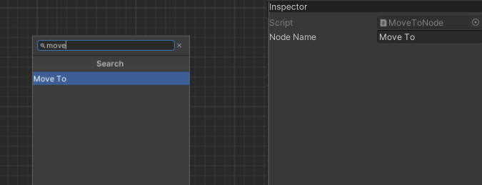
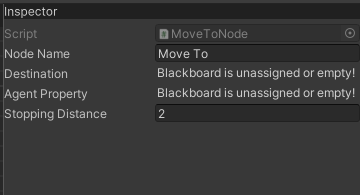
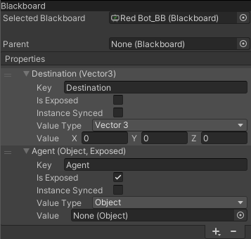
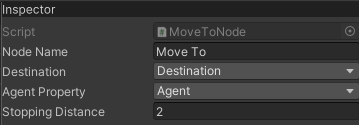
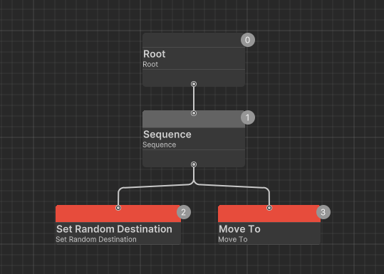
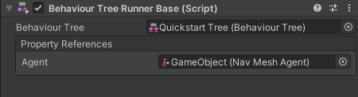

# Creating a custom Node script: Making our AI move
You'd probably want to create create a node that will run some custom logic. For the purpose of this example, we'll create a **Move To** node that will reference a `NavMeshAgent` component on our Runner, set its destination and halt the execution until the agent reaches the position.

First we need to create a script. Call it `MoveToNode` and make it inherit from `ActionNode` and implement `OnUpdate()` method, like this:

```cs
using Derrixx.BehaviourTrees;

public class MoveToNode : ActionNode
{
    protected override State OnUpdate() => State.Running;
}
```

`OnUpdate()` is every node's main execution method. The execution flow will halt as long as active node keeps returning `Running`, so it needs to return either `Success` or `Failure` to signal about the result of its execution.

*Note: You are free to name your nodes however you like, but for the sake of conventions I'd ask you to finish node class names with "Node", as its easier to distinguish them from other scripts and the editor strips this word*

Now, if you open Behaviour Tree Editor, you can see that you can add your node to the tree, however it doesn't do anything yet.



Now we need to reference our `NavMeshAgent` component. The easiest and most straightforward way would be to use `Runner.GetComponent<NavMeshAgent>()` to get the component from the GameObject that runs out BehaviourTree, but we'll use another approach.

```cs
using Derrixx.BehaviourTrees;
using UnityEngine;

public class MoveToNode : ActionNode
{
	[SerializeField] private Vector3BlackboardProperty _destination;
	[SerializeField] private ObjectBlackboardProperty _agentProperty;

    protected override State OnUpdate() => State.Running;
}
```

Here we added two `BlackboardProperty` fields: one for our agent and another for the destination. We'll asign values to these properties later, now let's finish our navigation logic:

```cs
using Derrixx.BehaviourTrees;
using UnityEngine;
using UnityEngine.AI;

public class MoveToNode : ActionNode
{
	[SerializeField] private Vector3BlackboardProperty _destination;
	[SerializeField] private ObjectBlackboardProperty _agentProperty;
	[SerializeField] private float _stoppingDistance = 2f;

	private NavMeshAgent _agent;

	public override void OnCreate()
	{
		_agent = _agentProperty.Value as NavMeshAgent;
	}

	protected override void OnActivate()
	{
		_agent.SetDestination(_destination.Value);
	}

	protected override State OnUpdate()
	{
		float distance = Vector3.Distance(_agent.transform.position, _destination.Value);
		float stoppingDistance = _stoppingDistance;
		return distance <= stoppingDistance ? State.Success : State.Running;
	}
}
```

We've overriden two more Node methods:
* `OnCreate()` behaves similarily to regular MonoBehaviour's `Awake()` and is mostly used to setup immutable field values, e.g. retrieve a component from the Blackboard Property
* `OnActivate()`, accordingly, behaves similarily to `OnEnable()` and its best use case is when you need to do something every time execution flow reaches this node, but `OnUpdate()` seems like too much.

In this code snippet, we've used these methods to set agent's destination every time this node becomes active, and modified the `OnUpdate()` method so that it returns `Success` once we get close enough to the destination point.

Next we need to open our Behaviour Tree Editor and create a Blackboard, then assign it. If you open you `MoveTo` node right now, you should see this:



So let's create our Blackboard Properties! Click the **+** button in the Blackboard Editor and add two properties.



We've created two Blackboard Properties with value types of Vector3 and UnityEngine.Object, as we've specified in our script. Now check your `MoveTo` node again and you should see two dropdowns appear with these properties selected. We've also checked the `IsExposed` toggle on the *Agent* property so we can assign it from our GameObject Inspector window.



*"But wait, we never assign the destination!"*, you might ask and you'd be completely right! Behaviour Trees are all about modularity and reusability, so we should move the code that sets the destination to another node, in case we might ever have to implement different sources of AI destination.

Create a script called `SetRandomDestinationNode.cs` and paste in the following code:
```cs
using Derrixx.BehaviourTrees;
using UnityEngine;
using UnityEngine.AI;

public class SetRandomDestinationNode : ActionNode
{
	[SerializeField] private float _radius;
	[SerializeField] private Vector3BlackboardProperty _destination;

	protected override State OnUpdate()
	{
		Vector3 randomDirection = Random.insideUnitSphere * _radius;
		randomDirection.y = 0f;

		if (NavMesh.SamplePosition(Runner.transform.position + randomDirection, out NavMeshHit hit, _radius, NavMesh.AllAreas))
		{
			_destination.Value = hit.position;
			return State.Success;
		}

		return State.Failure;
	}
}
```

This node simply gets a random point in a radius around our Runner and sets its position to our freshly created Blackboard Property.

Now add a `Sequence` node to your tree and wire them up like this:


The `Sequence` node is a composite node that executes its children from left to right until it reaches the end or one them returns `Failure`.

Finally, the last part. Create a GameObject and add `NavMeshAgent` and `BehaviourTreeRunnerBase` components to it. Next, assign our Behaviour Tree to the Runner and you should see a field appear for our exposed *Agent* property. Drag the component into the field so that it looks like this:



Now, if you run your game, you should see your Agent wander around the scene aimlessly, changing his destination every time he reaches the point. You can also add some other nodes, like `Wait` to add some cooldown.

If you've read to this point, I hope you'll use this package to develop something great.