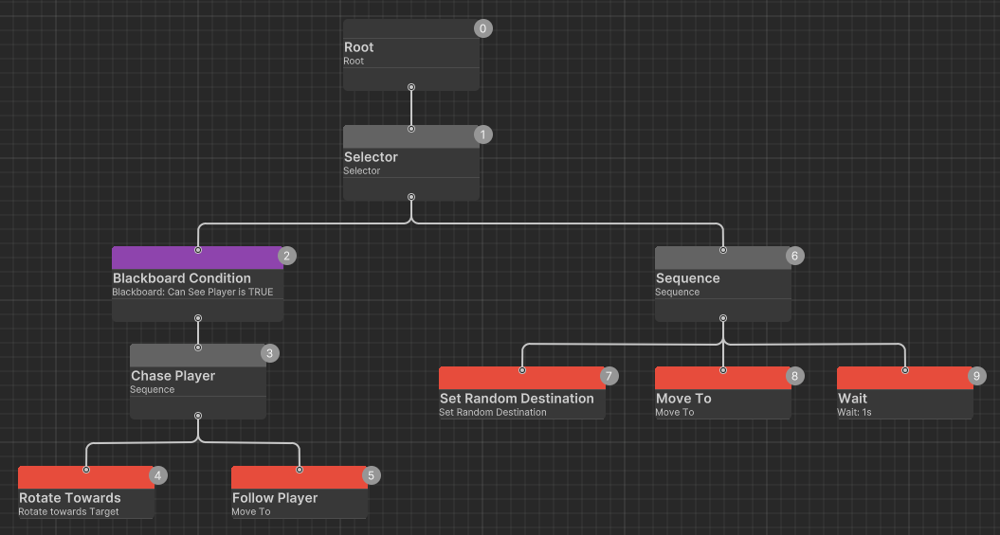
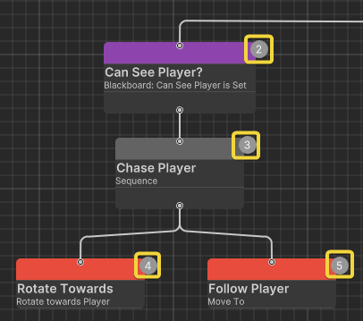
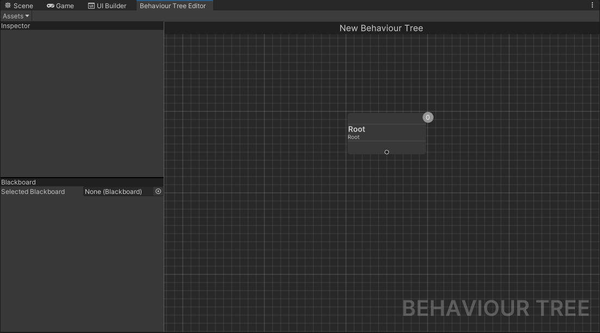
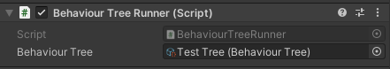
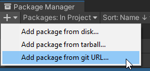
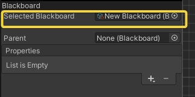
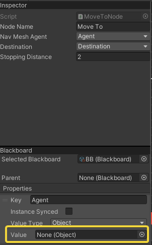

# Behaviour Trees
A small project of mine that I started to get a better grasp at the Behaviour Tree system and that will hopefully be of use to someone.
My main goal was to replicate the Behaviour Tree workflow from Unreal Engine in the Unity engine.

Key features:
* Free for commercial use
* Visual editor for clarity
* Smart blackboard implementation

## Table of contents:
- [Introduction](#introduction)
- [Installation](#installation)
- [Quickstart Guide](#quickstart-guide)
- [Blackboards & Blackboard Properties](#blackboards--blackboard-properties)

## Introduction
### What are Behaviour Trees?

If you are reading this, you are most likely familiar with [Finite-State Machines (FSM)](https://gamedevelopment.tutsplus.com/tutorials/finite-state-machines-theory-and-implementation--gamedev-11867). 
They are a great way to design a simple game AI, but quickly get cumbersome to handle when you need something more complex than 2-3 states. This is where Behaviour Trees kick in.


*An example Behaviour Tree showing a simple enemy AI*

### Behaviour Trees 101
Behaviour Trees are executed from top-to-bottom and from left-to-right, starting from the **Root** node. Every node has its execution order displayed in the upper-right corner.



There are 3 node types (excluding the Root node). The purple node on the top is a [Decorator](Documentation/Decorators.md) (or a [Conditional](Documentation/Decorators.md#conditionals), to be precise). It checks whether the enemy can see player (for how this is implemented, see [Blackboards & Blackboard Properties](#blackboards--blackboard-properties)) and if the condition is met, it allows the [Composite](Documentation/Composites.md) node underneath to execute. A composite node executes its child nodes one by one until it reaches the end or is forced to stop. The red child nodes of the Composite node are [Action](Documentation/Actions.md) nodes, which don't have any child nodes and simply perform an action and return a result.

## Quickstart Guide

### Creating a new Behaviour Tree
To start using Behaviour Trees, first create one by by going **Assets/Create/Derrixx/Behaviour Trees/Blackboard**. After you've create a Behaviour Tree asset, double-click on it and the **Behaviour Tree Editor** window will show up.


*What the Behaviour Tree Editor looks like for a newly created tree*

To add new nodes, right-click on the grid to open a context menu with all available node types.

### Assigning Behaviour Tree to a GameObject
After you've created and set up your Behaviour Tree, you'll most likely want to assign it to some GameObject and try it out. To do this, select a GameObject and add a `BehaviourTreeRunner` component, then assign your Behaviour Tree.



## Installation
There are several options on how you can install Behaviour Trees.

### Install via Package Manager 
Copy `https://github.com/D3RRIXX/Behaviour-Trees.git?path=src/Behaviour-Trees/Assets/Plugins/BehaviourTrees` and paste it into Unity Package Manager.



### Download a .unitypackage file
Go to [Releases](https://github.com/D3RRIXX/Behaviour-Trees/releases) page, download the last stable version and import it into your Unity project.

## Blackboards & Blackboard Properties
A Behaviour Tree uses a **Blackboard** to store and share data across all of its nodes, while a Blackboard by itself is a **ScriptableObject** that contains a list of **Blackboard Properties**.

### Creating a Blackboard
To use Blackboards, first you need to create one by going **Assets/Create/Derrixx/Behaviour Trees/Blackboard** and then assign it to your Behaviour Tree in the Editor.



After a Blackboard is assigned you can start adding new BlackboardProperties by clicking the **+** button and selecting the value type you want your property to hold.

BlackboardProperty supports all most commonly used data types:
* Boolean
* Int
* Float
* String
* Vector2
* Vector2Int
* Vector3
* UnityEngine.Object

### Using Blackboard Properties in your custom nodes
To reference Blackboard Properties in your nodes, add a serialized field to your node class. If you need a property with a specific value, use the according property type (e.g. `BoolBlackboardProperty`) or simply `BlackboardProperty` otherwise.

```cs
[SerializeField] private BoolBlackboardProperty _condition;
```

After a field is created, open your select your node in the Editor and you will see a dropdown menu with all Blackboard Properties of the type you've specified.


### Using Blackboard Properties from outside Behaviour Tree
Let's create an Action node class that gets a NavMeshAgent and target position from the Blackboard and sets agent's path.

```cs
using Derrixx.BehaviourTrees.Runtime.BlackboardScripts.BlackboardProperties;
using Derrixx.BehaviourTrees.Runtime.Nodes;
using UnityEngine;
using UnityEngine.AI;

public class MoveToNode : ActionNode
{
	[SerializeField] private ObjectBlackboardProperty _navMeshAgent;
	[SerializeField] private Vector3BlackboardProperty _destination;
	[SerializeField] private float _stoppingDistance = 2f;
		
	private NavMeshAgent _agent;
		
	protected override void OnStart()
	{
		_agent = (NavMeshAgent)_navMeshAgent.Value;
		_agent.SetDestination(_destination.Value);
	}

	protected override State OnUpdate()
	{
		float distance = Vector3.Distance(_agent.transform.position, _destination.Value);
		float stoppingDistance = _stoppingDistance;
		return distance <= stoppingDistance ? State.Success : State.Running;
	}
}
```

Then we open up our Editor, create needed Blackboard Properties and assign them to our node. However, we can't reference our agent from the Blackboard so we'll have to assign it from some other place.



Create a new script named TestAI and insert the following code:
```cs
using Derrixx.BehaviourTrees.Runtime;
using Derrixx.BehaviourTrees.Runtime.BlackboardScripts.BlackboardProperties;
using Derrixx.BehaviourTrees.Runtime.Nodes;
using UnityEngine;
using UnityEngine.AI;

[RequireComponent(typeof(NavMeshAgent)), RequireComponent(typeof(BehaviourTreeRunner))]
public class TestAI : MonoBehaviour
{
    [SerializeField] private NavMeshAgent agent;
    [SerializeField] private BehaviourTreeRunner runner;
}
```
Assign the references in the inspector. Now we need to reference our Blackboard. Luckily, BehaviourTreeRunner has a public `Blackboard` property